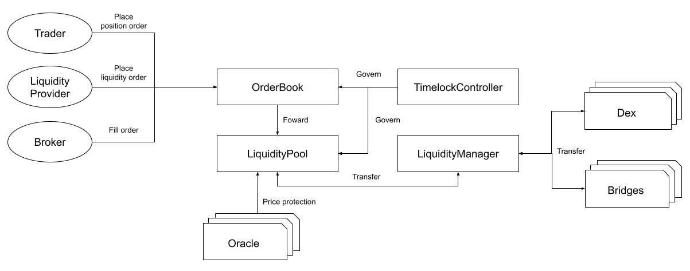

# mux-protocol

Mux Protocol is a next-generation margin-trading protocol that allows users to easily handle transaction across multiple networks. The fund management features also help liquidity providers to earn additional revenue on top of transaction fees.

## Overview




The `LiquidityPool` and `OrderBook` are the core modules for margin-trading.

The protocol defines a whitelist of assets in which tokens are allowed to be deposited as collateral or trade as position.

Traders need to place position-orders through the `OrderBook` contract to handle transactions of trading, withdrawal or liquidity providing.

The broker decides when to fill the placed orders according to the data from external oracles.

The `LiquidityManager` manages the assets from liquidity providers. There are various adapters to help `LiquidityManager` transfers assets between dex and chain bridges.

All the provided liquidities will be prioritized to fill the needs of opening positions.Otherwise, to earn extra profits, the assets will be used to farm on external dex when the utilization are lower than a threshold.

The `TimelockController` is transaction executor with time delay. It manages all the key parameters of `LiquidityManager` and `OrderBook`. Besides, after approved, it can still perform some limited operations (for example, pause) without delay for security reason.

## Compile

```
npx hardhat compile
```

## Run test cases

```
npx hardhat test
```

## Deploy test suite on Arbitrum-rinkeby

```
node_modules/.bin/hardhat --network arbrinkeby run scripts/deployArbtest.ts
```

